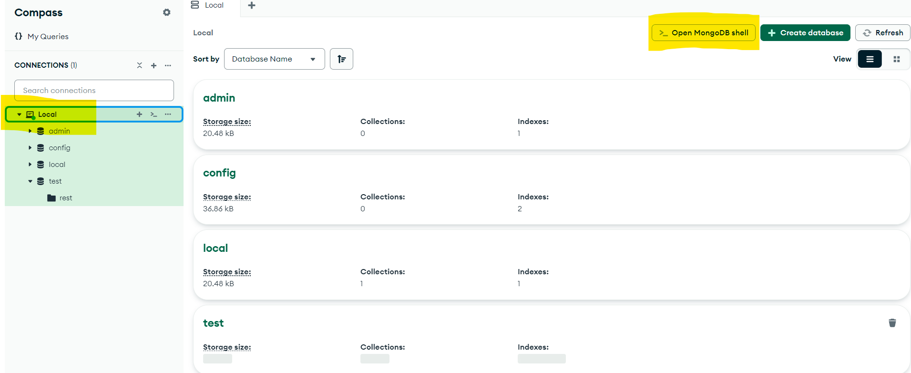

# MongoDb query's
<a href="https://github.com/SKRTEEEEEE">
<div align="center">
  
</div>
</a>

Actual ejercicio 2.4, antiguo ejercicio 5.4 del curso de [NodeJS](https://nodejs.org/en) de [ItAcademy](https://www.barcelonactiva.cat/es/itacademy).

## [Recursos](https://github.com/SKRTEEEEEE/markdowns/)

### Proceso
**_Para windows_**
#### 1. Instalar mongodb en la maquina
##### Descargar y instalar [MongoDB Community Server](https://www.mongodb.com/try/download/community)
- _Si no tenemos MongoDB Community Server_
- Descargamos la version actual de la comunidad de MongoDb Server, podemos encontrar-la en [esta pagina](https://www.mongodb.com/try/download/community).
- Configuramos la version para el tipo de arquitectura que utilize nuestro PC(x64/x32) y hacemos click a descargar. 
- Una vez descargada, instalaremos con la configuración por defecto(todo aceptar/continuar) 
##### Conectar red local
- _Si no tenemos una red conectada a MongoDb Community Server_
- Una vez instalado, podemos abrir MongoDBCompass
- Una vez abierto, podemos hacer click en la opción de nuevo conexión. En las opciones, dejaremos el URI por defecto, `mongodb://localhost:27017`. En nombre podremos `Local` y en color pondremos el que deseemos, se recomienda verde.
#### 2. Volcar base de datos desde un json
##### Descargar y configurar/instalar [MongoDB Command Line Database Tools](https://www.mongodb.com/try/download/database-tools)
- _Si no tenemos MongoDB Command Line Database Tools_
- Descargamos la version actual de MongoDB Command Line Database Tools, podemos encontrar-la en [esta pagina](https://www.mongodb.com/try/download/database-tools).
- Descargaremos la version para el tipo de arquitectura que utilize nuestro PC(x64/x32). 
- Descomprimiremos el archivo descargado, en la carpeta deseada, se recomienda en `C:\Program Files\MongoDB`. Se recomienda cambiar el nombre a la carpeta a `Tools`.
##### Volcado de datos usando `mongoimport`
- Copiamos [el archivo de la collección](./restaurants.json) en la carpeta de Documents de nuestro usuario.
- Abrimos PowerShell con permisos de administrador, para ello en Inicio, buscamos PowerShell, hacemos click con el botón derecho y hacemos click en la opción `Ejecutar como Administrador`.
- Navegamos a la carpeta, utilizando el siguiente comando:
    ```powershell
    cd "C:\Program Files\MongoDB\Tools\bin"
    ```
- Una vez ubicados en la carpeta, procederemos al volcado de la base de datos, utilizando el siguiente comando base:
    ```PowerShell
    .\mongoimport.exe -d <nombre-bdd> --collection <nombre-collection> --file "<ubicación-archivo>" --jsonArray
    ```
  - En nuestro caso utilizaremos este, pero **recuerda** sustituir con el nombre de tu usuario de Pc en el campo `<tu-usuario>`:
    ```PowerShell
    .\mongoimport.exe -d test --collection rest --file "C:\Users\<tu-usuario>\Documents\restaurants.json" --jsonArray
    ```
  - Una vez lanzado el comando, nos debería aparecer este mensaje en la terminal:
    ```PowerShell
    2024-09-19T22:11:21.588+0200    connected to: mongodb://localhost/
    2024-09-19T22:11:21.783+0200    3772 document(s) imported successfully. 0 document(s) failed to import.
    ```
- En este punto, en tu MongoDBCompass podrás visualizar la base de datos con su colección creada.
#### 3. Acceder a la base de datos `test`
- Para consultar la base de datos utilizaremos la shell de Mongo Db.
- Para ello, abrimos MongoDB Compass y hacemos click en nuestra conexión (en mi caso "Local"), y a continuación hacemos click en `Open MongoDB Shell`, _podemos ver estos dos botones resaltados en amarillo en la imagen de a continuación_:
  
- Una vez dentro de la terminal podemos ejecutar el siguiente comando para asegurarnos de estar dentro de nuestra base de datos `test`.
  ```js
  use test
  ```
- Después ya podremos proceder a ejecutar las consultar a nuestra base de datos.
#### 4. [Consultar base de datos](./restaurants-querys.md)
- [Haciendo click aquí podrás acceder a las **queries realizadas**](./restaurants-querys.md)
## Contacto

### Agradecimientos
#### [🏫 Institución: ItAcademy](https://www.barcelonactiva.cat/es/itacademy)
#### [🧑‍🏫 Docente: Francisco](https://frivero.com.ar/)

### Información de Contacto
#### [Web del desarrollador](profile-skrt.vercel.app)
#### [Envíame un mensaje](mailto:adanreh.m@gmail.com)

### Contribuciones y Problemas

  Si encuentras problemas o deseas contribuir al proyecto, por favor, crea un issue en el repositorio.

